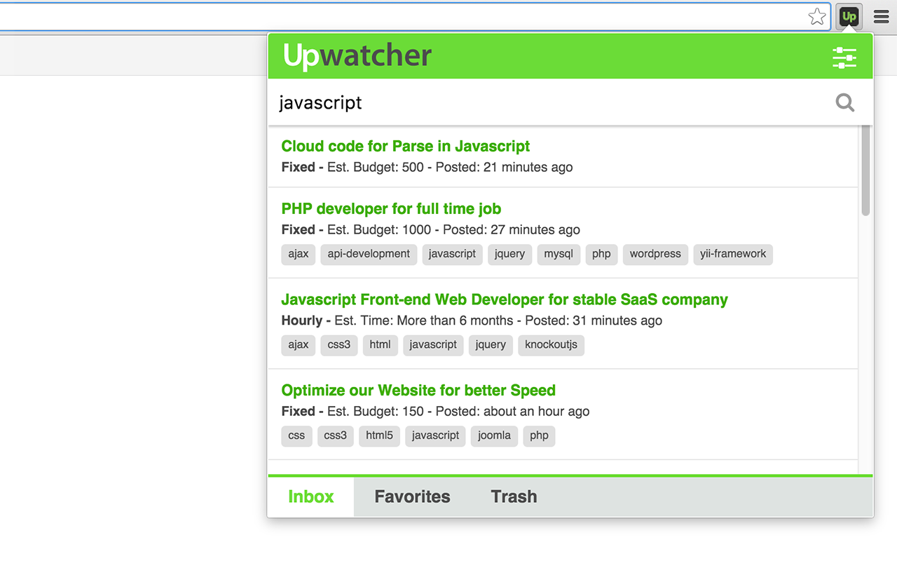
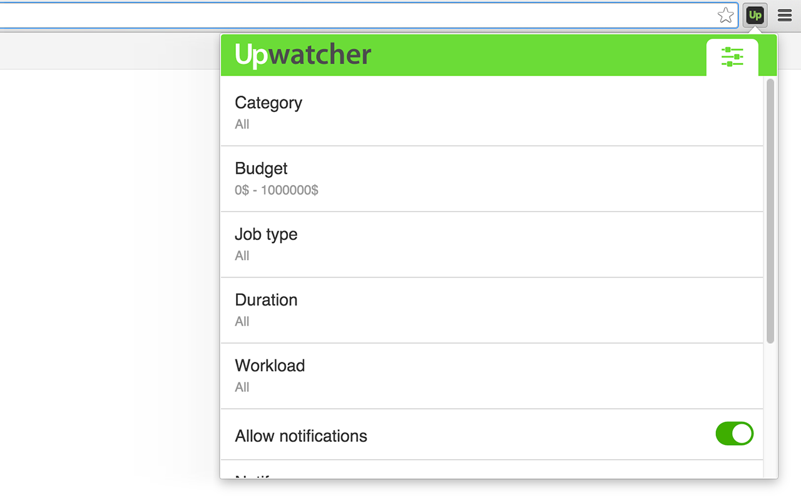

# Upwatcher. Upwork job watcher.

[App in store!](https://chrome.google.com/webstore/detail/upwatcher-upwork-job-watc/cpmlhfgkdmkceojlpjdnddhjimnlockd)

This extension use Upwork API for watching new jobs and showing notifications. Extension haven't access to any data on Upwork.com, also don't change any settings. It's working totally locally, API access needed only for use native Upwork search.

Features:
 - customizable search
 - ability to mark jobs as Favorites
 - show browser Notifications 
 - preview jobs in extension 
 - sharing jobs

